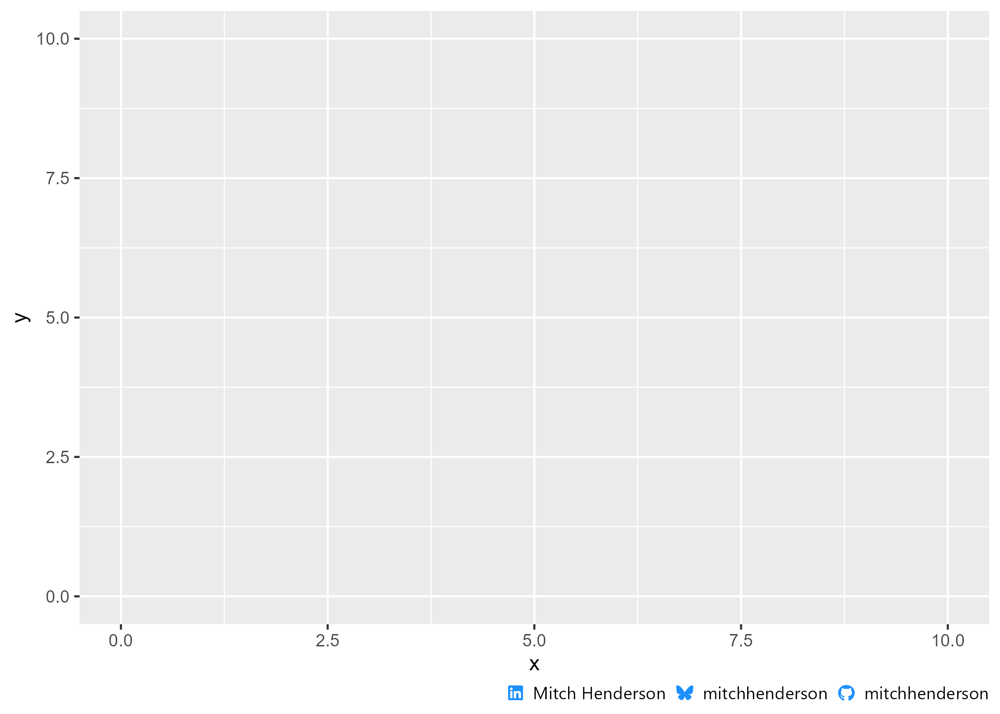

<!-- README.md is generated from README.Rmd. Please edit that file -->

# mitchhenderson

<!-- badges: start -->
<!-- badges: end -->

This is a package to store useful helper functions for personal use such
as `ggplot2` and `gt` themes, and social media captions.

## Installation

You can install the development version of mitchhenderson from
[GitHub](https://github.com/) with:

``` r
# install.packages("devtools")
devtools::install_github("mitchhenderson/mitchhenderson")
```

## Social captions

The `social_caption()` function generates a HTML string that, when
rendered, shows LinkedIn, Bluesky, and GitHub usernames and icons.

``` r
library(mitchhenderson)

socials <- social_caption(icon_colour = "dodgerblue", 
                          font_colour = "black")

socials
#> <span style='font-family:"Font Awesome 6 Brands";color: dodgerblue'>&#xf08c;</span> <span style='font-family: "Segoe UI";color: black'>Mitch Henderson</span>
#> <span style='font-family:"Font Awesome 6 Brands";color: dodgerblue'>&#xe671;</span> <span style='font-family: "Segoe UI";color: black'>mitchhenderson</span>
#> <span style='font-family:"Font Awesome 6 Brands";color: dodgerblue'>&#xf09b;</span> <span style='font-family: "Segoe UI";color: black'>mitchhenderson</span>
```

This can be used as a caption on ggplot objects.



## New post

The `new_post()` function will create a new folder and `.qmd` file in
the posts folder of my website project. The arguments to the function
will pre-fill the YAML. This function was found on [Thomas Mock’s
blog](https://themockup.blog/posts/2022-11-08-use-r-to-generate-a-quarto-blogpost/)
with only a very minor modification to remove the console interactivity.

``` r
new_post(
   title = "My new post",
   description = "My new post is about xyz",
   draft = TRUE
)
```
