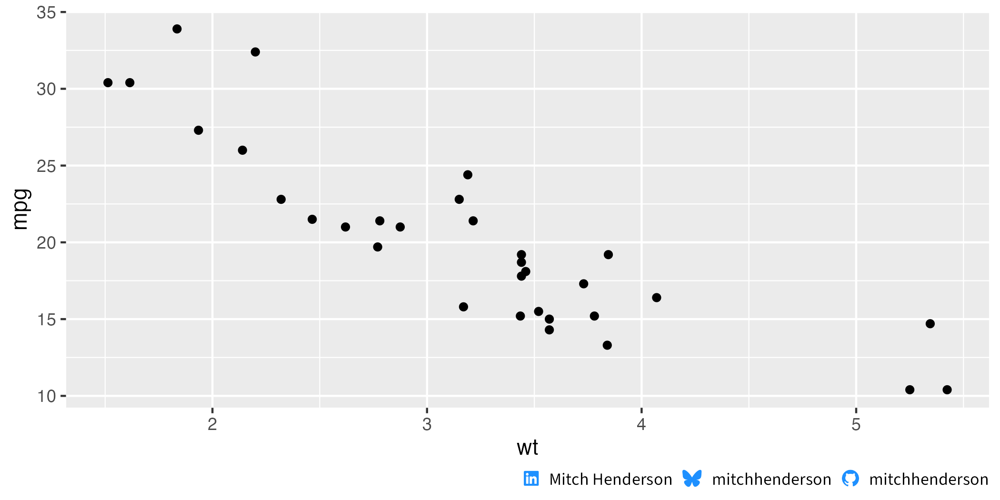

<!-- README.md is generated from README.Rmd. Please edit that file -->

# mitchhenderson

Helper functions I use across my own projects, mostly for the charts and
posts on [mitchhenderson.dev](https://mitchhenderson.dev). It’s built
for me, so the defaults are my name and my fonts, but you’re welcome to
use it or copy from it.

## Installation

``` r
# install.packages("remotes")
remotes::install_github("mitchhenderson/mitchhenderson-R-package")
```

## Social captions

`social_caption()` returns an HTML string with LinkedIn, Bluesky and
GitHub icons and usernames. The icons need the Font Awesome 7 Brands
font installed.

``` r
library(mitchhenderson)

socials <- social_caption(icon_colour = "dodgerblue",
                          font_colour = "black")

socials
#> <span style='font-family:"Font Awesome 7 Brands";color: dodgerblue'>&#xf08c;</span> <span style='font-family: "Source Sans 3";color: black'>Mitch Henderson</span>
#> <span style='font-family:"Font Awesome 7 Brands";color: dodgerblue'>&#xe671;</span> <span style='font-family: "Source Sans 3";color: black'>mitchhenderson</span>
#> <span style='font-family:"Font Awesome 7 Brands";color: dodgerblue'>&#xf09b;</span> <span style='font-family: "Source Sans 3";color: black'>mitchhenderson</span>
```

Use it as a plot caption, with `ggtext::element_markdown()` to render
the HTML.

``` r
library(ggplot2)
library(ggtext)

ggplot(mtcars, aes(wt, mpg)) +
  geom_point() +
  labs(caption = socials) +
  theme(plot.caption = element_markdown())
```



## New post

`new_post()` creates a folder and `.qmd` file in the `posts/` folder of
a Quarto site, with the YAML filled in from the arguments. It’s from
[Thomas Mock’s
blog](https://themockup.blog/posts/2022-11-08-use-r-to-generate-a-quarto-blogpost/),
with a small change to remove the console prompts.

``` r
new_post(
   title = "My new post",
   description = "My new post is about xyz",
   draft = TRUE
)
```
